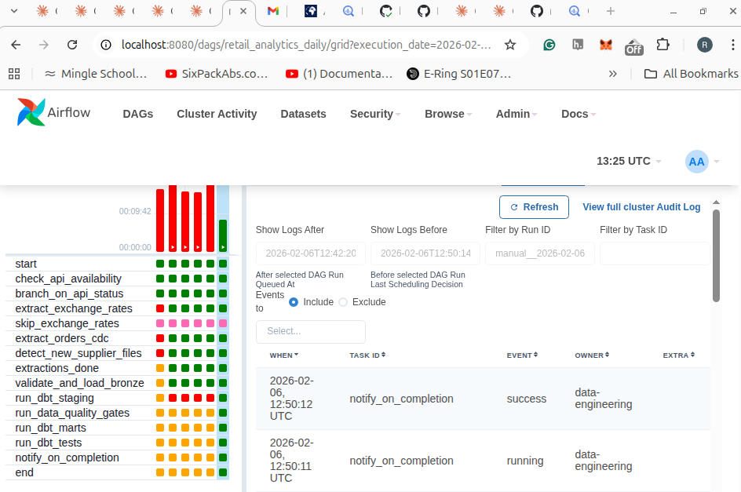
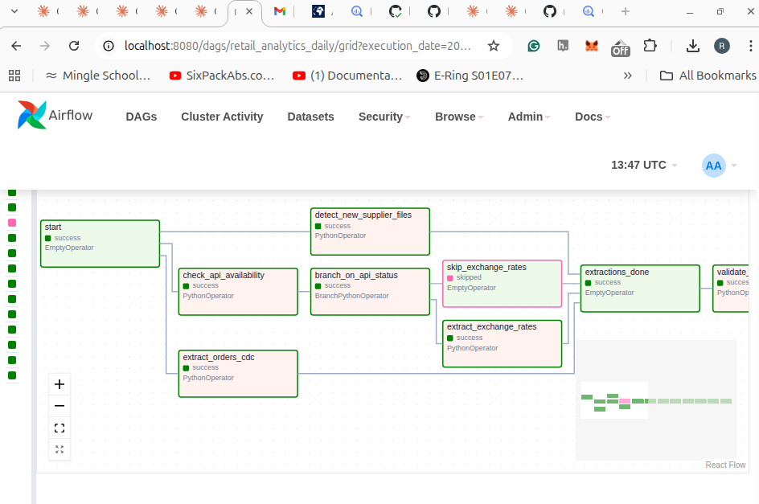
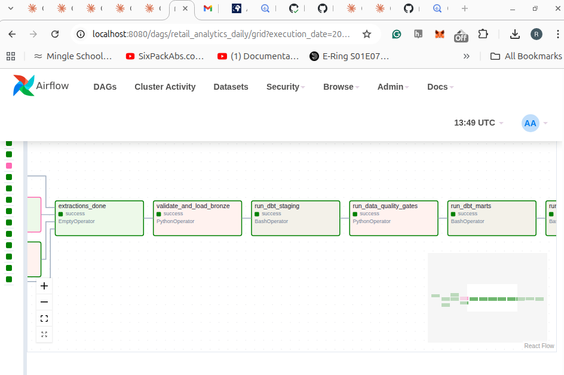

# 🏪 Retail Analytics Platform

A **production-grade batch data platform** demonstrating end-to-end data engineering: multi-source ingestion, medallion architecture, dbt transformations, quality gates, and orchestration — all running on GCP with Airflow.



## 🎯 What This Project Demonstrates

| Skill | Implementation |
|-------|----------------|
| **Multi-source ingestion** | REST API, CDC simulator, file drops — 3 distinct patterns |
| **Data validation** | Pydantic V2 contracts with quarantine routing |
| **Cloud data lake** | GCS bronze layer with Hive partitioning |
| **Data warehouse** | BigQuery with incremental MERGE (deduplication) |
| **Transformation** | dbt Core with 11 models, 42 tests |
| **Dimensional modeling** | Star schema (1 fact, 5 dimensions) |
| **Orchestration** | Airflow DAG with 14 tasks, branching, quality gates |
| **Testing** | 38 pytest unit tests, CI/CD with GitHub Actions |
| **Dashboard** | Streamlit with 4 analytics tabs |

---

## 📊 Architecture

```
┌─────────────────────────────────────────────────────────────────────────────┐
│                           DATA SOURCES                                       │
├─────────────────┬─────────────────┬─────────────────────────────────────────┤
│  Exchange Rates │  CDC Simulator  │  Supplier CSV Files                     │
│  (REST API)     │  (Faker)        │  (GCS bucket)                           │
└────────┬────────┴────────┬────────┴──────────┬──────────────────────────────┘
         │                 │                   │
         └────────────────┬┴───────────────────┘
                          ▼
┌─────────────────────────────────────────────────────────────────────────────┐
│                        INGESTION LAYER                                       │
│  • Pydantic V2 validation (type-safe, fast)                                 │
│  • Quarantine routing (bad records → separate bucket)                       │
│  • Pipeline run tracking (run_id on every record)                           │
└────────────────────────────────┬────────────────────────────────────────────┘
                                 ▼
┌─────────────────────────────────────────────────────────────────────────────┐
│                     BRONZE LAYER (GCS)                                       │
│  • Raw Parquet files, immutable                                             │
│  • Hive partitioned: /source=orders/date=2026-02-06/                        │
│  • Full audit trail preserved                                               │
└────────────────────────────────┬────────────────────────────────────────────┘
                                 ▼
┌─────────────────────────────────────────────────────────────────────────────┐
│                     SILVER LAYER (BigQuery + dbt)                            │
│  • stg_orders, stg_customers, stg_products, stg_exchange_rates              │
│  • Cleaned, typed, deduplicated                                             │
│  • 5 staging models as views                                                │
└────────────────────────────────┬────────────────────────────────────────────┘
                                 ▼
┌─────────────────────────────────────────────────────────────────────────────┐
│                     QUALITY GATES (Circuit Breakers)                         │
│  ✓ orders_not_empty (CRITICAL)                                              │
│  ✓ no_duplicate_order_ids (CRITICAL)                                        │
│  ✓ null_customer_rate < 1% (CRITICAL)                                       │
│  ✓ revenue_sanity_check (WARNING)                                           │
│  → Pipeline HALTS on critical failure                                       │
└────────────────────────────────┬────────────────────────────────────────────┘
                                 ▼
┌─────────────────────────────────────────────────────────────────────────────┐
│                     GOLD LAYER (Star Schema)                                 │
│  • fact_orders (incremental MERGE, grain: one row per order)                │
│  • dim_customers, dim_products, dim_date, dim_currency, dim_store           │
│  • 6 mart models as tables                                                  │
└────────────────────────────────┬────────────────────────────────────────────┘
                                 ▼
┌─────────────────────────────────────────────────────────────────────────────┐
│                     ANALYTICS LAYER                                          │
│  • Streamlit dashboard (4 tabs: Revenue, Products, Customers, Pipeline)     │
│  • Real-time BigQuery queries                                               │
└─────────────────────────────────────────────────────────────────────────────┘
```

---

## 🔄 Airflow DAG

The `retail_analytics_daily` DAG orchestrates the full pipeline with **14 tasks**:




**Key Features:**
- **Parallel extraction** — CDC, API, and file tasks run concurrently
- **Branching logic** — Skips exchange rate extraction if API is down
- **Quality gates** — SQL circuit breakers halt pipeline on critical failures
- **Retry with backoff** — 2 retries, exponential backoff (3→6→12 min)
- **Idempotent** — Safe to re-run; MERGE handles duplicates

**Task Flow:**
```
start
  ├── check_api_availability → branch_on_api_status
  │                              ├→ extract_exchange_rates ──┐
  │                              └→ skip_exchange_rates ─────┤
  ├── extract_orders_cdc ────────────────────────────────────┤
  └── detect_new_supplier_files ─────────────────────────────┘
                                                              │
                                                    extractions_done
                                                              │
                                                  validate_and_load_bronze
                                                              │
                                                       run_dbt_staging
                                                              │
                                                    run_data_quality_gates
                                                              │
                                                        run_dbt_marts
                                                              │
                                                         run_dbt_tests
                                                              │
                                                      notify_on_completion
                                                              │
                                                             end
```

---

## 🚀 Quick Start

### Prerequisites
- Python 3.11+
- Docker & Docker Compose
- GCP account (free tier works)

### Local Development

```bash
# Clone the repo
git clone https://github.com/rkendev/retail-analytics-platform.git
cd retail-analytics-platform

# Install dependencies
make install

# Run tests
make test

# Run the pipeline locally (writes to local files)
make run-local
```

### Run with Airflow (Docker)

```bash
# 1. Set up GCP credentials
cp ~/.config/gcloud/application_default_credentials.json secrets/gcp-key.json

# 2. Initialize Airflow
make airflow-init

# 3. Start Airflow
make airflow-up

# 4. Open the UI
open http://localhost:8080  # login: airflow / airflow

# 5. Unpause and trigger the DAG
```

### Run the Dashboard

```bash
streamlit run app/dashboard.py
```

---

## 📁 Project Structure

```
retail-analytics-platform/
├── dags/
│   └── retail_analytics_daily.py   # Airflow DAG (14 tasks)
├── src/
│   ├── extractors/                  # API, CDC, file extractors
│   │   ├── api_extractor.py         # Open Exchange Rates
│   │   ├── cdc_extractor.py         # Faker-based CDC simulator
│   │   └── file_extractor.py        # GCS file watcher
│   ├── validators/                  # Pydantic data contracts
│   ├── loaders/                     # GCS + BigQuery loaders
│   └── pipeline.py                  # Main orchestrator
├── dbt_retail/
│   ├── models/
│   │   ├── staging/                 # 5 views (bronze → silver)
│   │   └── marts/                   # 6 tables (star schema)
│   └── tests/                       # 42 dbt tests
├── app/
│   └── dashboard.py                 # Streamlit (4 tabs)
├── tests/                           # 38 pytest unit tests
├── configs/                         # dev.yaml, prod.yaml
├── docker-compose-airflow.yml       # Local Airflow setup
├── .github/workflows/ci.yml         # GitHub Actions CI
└── docs/
    ├── ARCHITECTURE.md
    ├── DATA_CONTRACTS.md
    └── DATA_DICTIONARY.md
```

---

## 🛠 Tech Stack

| Layer | Technology | Rationale |
|-------|------------|-----------|
| **Cloud** | GCP | BigQuery serverless, free tier, $300 credits |
| **Storage** | GCS | Immutable bronze layer, Hive partitioning |
| **Warehouse** | BigQuery | Native MERGE, partitioning, free 1TB/month queries |
| **Orchestration** | Airflow 2.9 | Industry standard (48% of DE job postings) |
| **Transformation** | dbt Core 1.8 | SQL + software engineering (62% of postings) |
| **Validation** | Pydantic V2 | Type-safe, Python-native, 17x faster than V1 |
| **Dashboard** | Streamlit | Python-native, free, fast prototyping |
| **CI/CD** | GitHub Actions | Lint (ruff), type-check (mypy), test (pytest) |

---

## ✅ Data Quality Strategy

Quality is enforced at **four layers**:

| Layer | Tool | Checks |
|-------|------|--------|
| **Ingestion** | Pydantic | Schema validation, type coercion, quarantine routing |
| **Staging** | dbt tests | not_null, unique, accepted_values, relationships |
| **Quality Gates** | SQL | Circuit breakers between staging → marts |
| **Marts** | dbt tests | Referential integrity, business rules |

**Circuit Breaker Pattern:**
```python
# Pipeline HALTS if any CRITICAL check fails
quality_checks = [
    {"name": "orders_not_empty", "severity": "CRITICAL"},
    {"name": "no_duplicate_order_ids", "severity": "CRITICAL"},
    {"name": "null_customer_rate < 1%", "severity": "CRITICAL"},
    {"name": "revenue_sanity_check", "severity": "WARNING"},  # logs only
]
```

---

## 📈 Data Model

**Star Schema** — optimized for analytical queries:

```
                    ┌─────────────────┐
                    │   dim_date      │
                    │   (calendar)    │
                    └────────┬────────┘
                             │
┌─────────────────┐    ┌─────┴─────┐    ┌─────────────────┐
│  dim_customers  │────│fact_orders│────│  dim_products   │
│  (segments)     │    │  (grain:  │    │  (categories)   │
└─────────────────┘    │ one order)│    └─────────────────┘
                       └─────┬─────┘
                             │
┌─────────────────┐          │          ┌─────────────────┐
│  dim_currency   │──────────┴──────────│   dim_store     │
│  (172 codes)    │                     │  (locations)    │
└─────────────────┘                     └─────────────────┘
```

**Incremental Strategy:**
- `fact_orders`: MERGE on `order_id` (handles late-arriving updates)
- Dimensions: Full refresh (small tables, < 10K rows)

---

## 🧪 Testing

```bash
# Run all tests
make test

# Unit tests only (fast, no external deps)
pytest tests/unit/ -v

# Integration tests (requires GCP credentials)
pytest tests/integration/ -v

# Lint + type check
make lint
make type-check

# dbt tests
cd dbt_retail && dbt test
```

**Test Coverage:**
- 38 pytest tests (extractors, validators, loaders)
- 42 dbt tests (schema + data quality)
- CI runs on every push (GitHub Actions)

---

## 💰 Cost Analysis

| Service | Monthly Cost | Notes |
|---------|-------------|-------|
| BigQuery | **$0** | Free tier: 1TB queries, 10GB storage |
| GCS | ~$0.50 | ~25GB at $0.02/GB |
| Cloud Composer | $300+ | **Avoided:** Using local Airflow |
| **Total** | **< $5/month** | Free tiers + local orchestration |

---

## 📚 Key Design Decisions

### Why Pydantic over Great Expectations?
Pydantic is better for **record-level validation** at ingestion. GE excels at **statistical profiling** at the warehouse layer. For this use case, Pydantic is faster, lighter, and more Pythonic.

### Why Quarantine Pattern?
One bad record shouldn't block 999 good records. Invalid data routes to a quarantine bucket with full error context. Quality gates at the warehouse layer catch systemic issues.

### Why BigQuery over Snowflake?
GCP-native, serverless, built-in MERGE, generous free tier. Trade-off: Snowflake has better multi-cloud support and concurrency.

### Why Local Airflow over Cloud Composer?
Cloud Composer costs $300+/month. For a portfolio project, Docker Compose Airflow demonstrates the same skills at zero cost.

---

## 🎓 Lessons Learned

1. **dbt incremental models require careful key selection** — Using `order_id` as the unique key with MERGE handles both inserts and updates, but you must handle the case where source data has duplicates *before* they reach the warehouse.

2. **Airflow BashOperator PATH issues in Docker** — Packages installed via `_PIP_ADDITIONAL_REQUIREMENTS` go to `/home/airflow/.local/bin`, which isn't in PATH by default. Fix: `export PATH=$PATH:/home/airflow/.local/bin` in the bash command.

3. **Pydantic V2 coercion is powerful but subtle** — Using `BeforeValidator` to normalize data (e.g., empty strings → None) before validation catches issues that would otherwise require messy try/except blocks.

4. **Quality gates belong between layers, not just at the end** — Running checks between staging → marts (not just at the end) means you catch data issues before expensive transformations run.

5. **Docker Compose env vars need container recreation** — `docker compose restart` doesn't pick up `.env` changes; you need `docker compose up -d --force-recreate`.

---

## 🚧 Future Improvements

- [ ] SCD Type 2 on `dim_customers` (track segment changes over time)
- [ ] Data freshness monitoring with Slack alerts
- [ ] Deploy Streamlit dashboard to Cloud Run
- [ ] Add data lineage visualization (dbt docs)
- [ ] Cost tracking dashboard (BigQuery slot usage)

---

## 📬 Contact

**Roy Ken** — [GitHub](https://github.com/rkendev) | [LinkedIn](https://linkedin.com/in/YOUR_LINKEDIN)

Built as part of a professional data engineering portfolio. Feedback welcome!
