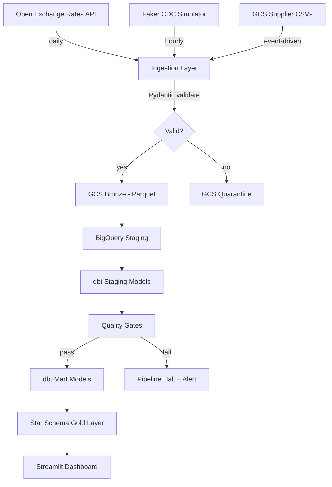

# 🏪 Retail Analytics Platform

A production-grade batch data platform that ingests retail data from **three distinct sources**, transforms it through a **medallion architecture** into a **star schema dimensional model**, and serves analytics via a Streamlit dashboard.

```
REST API + CDC Simulator + CSV Files → GCS Bronze → BigQuery → dbt Star Schema → Dashboard
```

## Architecture



## Quick Start

```bash
# 1. Clone and install
git clone https://github.com/YOUR_USERNAME/retail-analytics-platform.git
cd retail-analytics-platform
make install

# 2. Seed sample data
python scripts/seed_data.py

# 3. Run the pipeline locally
make run-local

# 4. Run tests
make test

# 5. (Optional) Run with Docker
make docker-build && make docker-run
```

## Tech Stack

| Component | Tool | Why |
|-----------|------|-----|
| Cloud | GCP | BigQuery serverless, free tier, $300 credits |
| Storage | GCS | Immutable bronze layer, Hive partitioning |
| Warehouse | BigQuery | Native MERGE, partitioning, free 1TB/month |
| Orchestration | Cloud Composer / Airflow | Industry standard, 48% of DE job postings |
| Transformation | dbt Core 1.8+ | SQL + software engineering, 62% of postings |
| Validation | Pydantic V2 | Type-safe, Python-native, fast |
| Dashboard | Streamlit | Python-native, free, deployable on Cloud Run |
| CI/CD | GitHub Actions | Lint, type-check, test, dbt compile on every PR |

## Data Model

**Star Schema** — one fact table, five dimensions:

| Table | Grain | Type |
|-------|-------|------|
| `fact_orders` | One row per order | Incremental (MERGE) |
| `dim_customers` | One row per customer | Full refresh |
| `dim_products` | One row per product | Full refresh |
| `dim_date` | One row per calendar date | Full refresh |
| `dim_currency` | One row per currency code | Full refresh |
| `dim_store` | One row per store | Full refresh |

## Project Structure

```
retail-analytics-platform/
├── .github/workflows/ci.yml      # CI pipeline
├── configs/                       # YAML configs (dev/test/prod)
├── src/
│   ├── extractors/                # API, CDC, file extractors
│   ├── validators/                # Pydantic data contracts
│   ├── loaders/                   # GCS + BigQuery loaders
│   ├── quality/                   # Circuit breaker quality gates
│   ├── pipeline/                  # Pipeline orchestrator
│   └── utils/                     # Logging, metrics
├── dags/                          # Airflow DAG definitions
├── dbt_retail/                    # Full dbt project
│   ├── models/staging/            # Views — clean + dedup
│   ├── models/intermediate/       # Ephemeral enrichment
│   ├── models/marts/              # Star schema gold layer
│   ├── macros/                    # Currency conversion
│   └── tests/                     # Custom SQL assertions
├── tests/
│   ├── unit/                      # pytest (no external deps)
│   └── integration/               # E2E with local data
├── scripts/                       # Data seeding, utilities
├── docs/                          # Architecture, data dictionary
├── Dockerfile
├── docker-compose.yml
├── Makefile
└── README.md
```

## Design Decisions

### 1. Medallion Architecture (Bronze → Silver → Gold)
**Why:** Separates raw storage (immutable, auditable) from cleaned staging (typed, deduped) from business-ready marts (dimensional, optimized). Each layer can be rebuilt independently.

### 2. Pydantic for Ingestion Validation (not Great Expectations)
**Why:** Lighter footprint for record-level validation. GE is better for statistical profiling at the warehouse layer, but Pydantic is faster and more Pythonic for per-record schema enforcement.

### 3. Quarantine Pattern (not fail-fast)
**Why:** A single bad record shouldn't block 999 good records. Invalid data routes to quarantine with full error context for later review. The quality gates at the warehouse layer catch systemic issues.

### 4. BigQuery over Snowflake
**Why:** GCP-native, serverless, built-in MERGE, free tier, no cluster management. Trade-off: Snowflake has better multi-cloud and concurrency support.

## Data Quality

Quality is enforced at **four layers:**

1. **Ingestion** — Pydantic schema validation with quarantine routing
2. **Staging** — dbt tests (not_null, unique, relationships, expression checks)
3. **Gates** — SQL circuit breakers between staging → marts (halt on failure)
4. **Marts** — dbt tests on the final star schema (referential integrity)

## Running Tests

```bash
make test              # Unit tests only (fast, no deps)
make test-integration  # Full pipeline E2E (local data)
make lint              # ruff linting
make type-check        # mypy type checking
```

## Lessons Learned

*TODO: Fill in as you build — be honest about what was hard.*

1. ...
2. ...
3. ...

## Future Improvements

- [ ] SCD Type 2 on `dim_customers` (track segment changes over time)
- [ ] Data freshness monitoring with Slack alerts
- [ ] Cost tracking dashboard (BigQuery slot usage + GCS storage)
- [ ] Streamlit dashboard deployed on Cloud Run
- [ ] Blog post on design decisions

## Cost Analysis

| Service | Monthly Estimate | Notes |
|---------|-----------------|-------|
| BigQuery | $0 (free tier) | 1TB/month queries free, 10GB storage free |
| GCS | ~$0.50 | ~25GB bronze data at $0.02/GB |
| Cloud Composer | $300+ | **For portfolio:** run Airflow locally via Docker |
| Total (portfolio) | **< $5/month** | Using free tiers + local Airflow |
